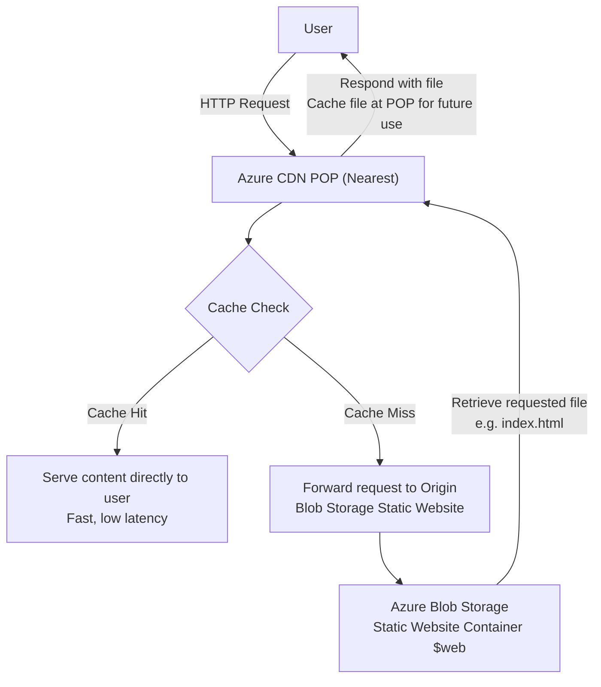

## Real-World Problem Scenario

A small business or an individual seeking to showcase a personal portfolio requires a simple, cost-effective, and highly available website. The content consists primarily of static files (HTML, CSS, JavaScript, images) and does not necessitate complex server-side processing or databases.

---

## Why This Matters & Our Architectural Approach

### Problem

Traditional web hosting often involves the acquisition and maintenance of web servers, including managing operating systems, applying security patches, and handling server-side configurations. For static content, this overhead is unnecessary, leading to increased costs and complexity. Furthermore, delivering content globally from a single server can result in high latency for distant users, impacting performance.

### Why This Way

Azure Blob Storage, when configured for static website hosting, provides a serverless solution that eliminates the need for managing traditional web servers. This approach is highly scalable and exceptionally cost-effective, as costs are incurred only for the storage consumed and the operations performed, rather than for always-on compute resources.

Integrating Azure Content Delivery Network (CDN) with the static website further enhances performance by caching content at edge locations geographically closer to end-users. This significantly reduces latency and offloads traffic from the origin storage account, improving the user experience globally.

This architectural choice directly aligns with the **Cost Optimization** and **Performance Efficiency** pillars of the [Azure Well-Architected Framework](https://learn.microsoft.com/en-us/azure/architecture/framework/).

The abstraction of infrastructure management inherent in this serverless model leads to substantial operational cost savings and simplifies the deployment process, showcasing a key advantage of cloud platforms.

---

## Azure Services Involved

- **Azure Storage Account (Blob Storage)**
- **Azure CDN**

## Guide: Host a Static Website on Azure Blob Storage and CDN
This guide provides a complete walkthrough for hosting a static website on Azure, from creating the sample files to deploying and distributing them globally with a CDN.

---

## Part 1: Your Static Website Code

First, you'll need the website files. Create three files on your computer named `index.html`, `style.css`, and `script.js` and paste the code below into them.

### `index.html`
This file is the main structure of your website.

```html
<!DOCTYPE html>
<html lang="en">
<head>
    <meta charset="UTF-8">
    <meta name="viewport" content="width=device-width, initial-scale=1.0">
    <title>Alex Doe ' Personal Portfolio</title>
    <link rel="stylesheet" href="style.css">
</head>
<body>
    <header>
        <h1>Alex Doe</h1>
        <p>Web Developer & Cloud Enthusiast</p>
    </header>

    <main>
        <section id="about">
            <h2>About Me</h2>
            <p>Welcome to my corner of the web! This is a simple static site hosted on <strong>Azure Blob Storage</strong> and delivered globally via <strong>Azure CNe</strong>. I'm passionate about building scalable and efficient web solutions.</p>
        </section>

        <section id="projects">
            <h2>My Projects</h2>
            <div class="project-card">
                <h3>Project Alpha</h3>
                <p>A description of the first amazoƒ project.</p>
            </div>
            <div class="project-card">
                <h3>Project Beta</h3>
                <p>A description of the second incredible project.</p>
            </div>
        </section>
    </main>

    <footer>
        <button id="contactBtn">Contact Me</button>
        <p>&copy; 2025 Alex Doe</p>
    </footer>

    <script src="script.js"></script>
</body>
</html>
```

### `style.css`
This file adds styling to make your website look good.

```c\n
body {
    font-family: -apple-system, BlinkMacSystemFont, "Segoe UI", Roboto, Helvetica, Arial, sans-serif;
    line-height: 1.6;
    margin: 0;
    padding: 0;
    background-color: #f4f4f4;
    color: #333;
    display: flex;
    flex-direction: column;
    align-items: center;
}

header {
    background-color: #0078D4;
    color: #fff;
    padding: 2rem 1rem;
    text-align: center;
    width: 100%;
}

header h1 {
    margin: 0;
    font-size: 2.5rem;
}

main {
    width: 90%;
    max-width: 800px;
    margin: 2rem 0;
}

section {
    background: #fff;
    padding: 1.5rem;
    margin-bottom: 1rem;
    border-radius: 8px;
    box-shadow: 0 2px 4px rgba(0,0,0,0.1);
}

.project-card {
    border-left: 4px solid #0078D4;
    padding-left: 1rem;
    margin-top: 1rem;
}

footer {
    text-align: center;
    padding: 1rem;
    width: 100%;
}

button {
    background-color: #0078D4;
    color: white;
    border: none;
    padding: 10px 20px;
    font-size: 1rem;
    border-radius: 5px;
    cursor: pointer;
    transition: background-color 0.3s ease;
}

button:hover {
    background-color: #005a9e;
}
```

### `script.js`
This file adds simple interactivity.
```js
document.addEventListener('DOMContentLoaded', () => {
    const contactButton = document.getElementById('contactBtn');

    if (contactButton) {
        contactButton.addEventListener('click', () => {
            alert('Thanks for your interest! You can reach me at alex.doe@email.com.');
        });
    }
});
```

## Part 2: Step-by-Step Azure Hosting Process
Follow these steps to get your site live. You'll need an active Azure subscription to begin.

---
## Step 1: Create a Storage Account
Your website files will live inside an Azure Storage Account.

1.  Sign in to the Azure Portal.
2.  Click `+ Create a resource`. Search for `Storage Account` and click `Create`.
3.  On the **Basics** tab:
    * **Subscription**: Choose your Azure subscription.
    * **Resource group**: Click `Create new` and give it a name like `MyStaticSiteRG`.
    * **Storage account name**: Enter a globally unique, lowercase name (e.g., `youruniquenameportfolio`).
    * **Region**: Choose a region close to you (e.g., `(US) East US`).
    * **Performance**: Select `Standard`.
    * **Redundancy**: Select `Locally-redundant storage (LRS)` for the lowest cost.
4.  Click `Review + create` and then `Create`. Wait for the deployment to finish.

---
## Step 2: Enable Static Website Hosting
Now, you'll configure the storage account to serve web content.

1.  Once your storage account is created, click **Go to resource**.
2.  In the left-hand menu, scroll down to the **Data management** section and click on **Static website**.
3.  Toggle the status to **Enabled**.
4.  For the **Index document name**, enter `index.html`.
5.  Leave the **Error document path** blank for now.
6.  Click **Save**.
7.  Azure will now display a **Primary endpoint URL**. Copy this URL and save it. This is the direct link to your website on Blob Storage. It will look something like `https://youruniquenameportfolio.z13.web.core.windows.net/`.

---
## Step 3A: Upload Your Website Files Manually
1.  In the left-hand menu, under **Data storage**, click on **Containers**.
2.  You will see a new container named `$web`. This was created automatically when you enabled the static website feature. Click on it.
3.  Click the **Upload** button.
4.  In the panel that opens, click the folder icon to browse for your files. Select the `index.html`, `style.css`, and `script.js` files you created earlier.
5.  Click **Upload**.


## Step 3B: Upload Your Website Files using Visual Studio Code

### Prerequisites
- An active **Azure subscription** is required.
- It is recommended to install **Visual Studio Code** with the **Azure Storage extension** for streamlined deployment.

1. Create Sample Website Files

    - On your local file system, create a folder (e.g., `mywebsite`).
    - Inside this folder, create or download the three files index.html, style.css and script.js
  
2. Deploy Website

    - Open the `mywebsite` folder in **Visual Studio Code**.
    - In the Explorer panel, right-click within the folder and select **"Deploy to Static Website..."**
    - Follow the prompts:
      - Log into Azure.
      - Select your subscription.
      - Choose the storage account where static website hosting was enabled.
    - Visual Studio Code will upload your files to the **`$web`** container.

3. Verify Deployment

    - Once deployment is complete, Visual Studio Code will display a success message and provide the **primary endpoint URL** for your static website.
    - Open this URL in a browser to confirm your "Hello World!" page is live.
---

>  **Checkpoint:** Your site is now live! Paste the **Primary endpoint URL** you copied earlier into your browser. You should see your portfolio website. The next step will make it faster using a CDN.

---

## Step 4: Set Up the Azure CDN
A Content Delivery Network (CDN) will cache your website at edge locations around the world, making it load faster for all users.

1.  In the Azure Portal, click `+ Create a resource`. Search for `Front Door and CDN profiles` and click `Create`.
2.  Select **Explore other offerings** and then choose **Azure CDN Standard from Microsoft (classic)**. Click **Continue**.
3.  On the **Basics** tab:
    * **Name**: Give your CDN profile a name, like `my-portfolio-cdn`.
    * **Resource Group**: Select the same resource group you created earlier (`MyStaticSiteRG`).
    * **Pricing tier**: Select `Standard Microsoft`.
4.  Click `Review + create` and then `Create`.
5.  After the CDN profile is deployed, go to the resource.
6.  Click `+ Endpoint`.
7.  In the "Add an endpoint" panel:
    * **Name**: Give the endpoint a globally unique name. This becomes part of your URL (e.g., `my-portfolio-site`). The full URL will be `my-portfolio-site.azureedge.net`.
    * **Origin type**: Select `Storage static website`.
    * **Origin hostname**: A dropdown will appear. Select your storage account's static website endpoint (it will have `web.core.windows.net` in the name).
8.  Click **Add**.

>  **Patience is key:** CDN endpoint propagation can take several minutes (sometimes up to 10-15 minutes).

---
## Step 5: Test Your CDN Link
1.  Once the endpoint status shows as "Running" (you may need to refresh), copy the **Endpoint hostname** (e.g., `https://my-portfolio-site.azureedge.net`).
2.  Paste this new URL into your browser. You should see the exact same website, but this time it's being served from the super-fast Azure CDN!

---
## Part 3: Technical Explanation of the Flow
Here’s a breakdown of what happens when a user visits your new CDN-powered website.

1.  **User Request**: A user enters your CDN URL (`https://my-portfolio-site.azureedge.net`) into their browser. The request is routed to the nearest Azure CDN Point of Presence (POP), which is a data center geographically close to the user.
2.  **CDN Cache Check**: The CDN POP checks its local cache for the requested files (`index.html`, `style.css`, etc.).
3.  **Cache Hit (Fast)**: If the files are in the cache and haven't expired, the CDN immediately serves them to the user. This is extremely fast because the data travels a very short physical distance.
4.  **Cache Miss (First Time)**: If this is the first time the file is requested from this POP (or the cached version has expired), the CDN forwards the request to the **Origin**.
5.  **Origin Request**: The **Origin** is the source of truth for your content. In this project, the origin is the **Static Website endpoint** of your Azure Blob Storage account (`https://...web.core.windows.net/`).
6.  **Blob Storage Serves Content**: Azure Storage receives the request and retrieves the appropriate file (e.g., `index.html`) from the special `$web` container.
7.  **Response and Caching**: The file is sent back from Blob Storage to the CDN POP. The POP then does two things:
    * It serves the file to the user's browser.
    * It stores a copy of the file in its cache for future requests to that same location.

## Technical Network Diagram for Azure CDN-powered Website


<pre>
+--------------------+                  +----------------------------+
|                    |                  |                            |
|     User Browser   +----HTTP Request->|  Azure CDN POP (Nearest)   |
|  (https://my-...)  |                  |                            |
+--------------------+                  +------------+---------------+
                                                |
                                                | Cache Check
                           +--------------------+---------------------+
                           |                                          |
                   Cache Hit?                                  Cache Miss?
                   (Files in CDN Cache)                      (Files not in Cache or Expired)
                           |                                          |
        +------------------+----------------+           +-------------+--------------+
        |                                   |           |                            |
Serve content directly                   Serve from   Forward request to Origin (Blob Storage)
to user (Fast, low latency)              user (Fast)    (Static website endpoint)
                                                                |
                                                                v
                                              +----------------------------+
                                              |                            |
                                              |   Azure Blob Storage       |
                                              |  Static website container  |
                                              |        ($web container)    |
                                              +----------------------------+
                                                                |
                                             Retrieves requested file (e.g., index.html)
                                                                |
                                                                v
                              +----------------+---------------+-----------------+
                              |                |                                 |
                       Respond with file        Cache file at POP for future use    Return file to User Browser
</pre>





This architecture is highly efficient. The slow trip to the origin server only happens on the first request from any given region. All subsequent requests are handled rapidly by the much closer CDN edge servers, providing a great user experience and reducing load on the storage account.


## Part 4: Editing the Website Files and Updating the CDN
Q. What happens when you want to make a change to any of the webpage files and upload the updated files to the $web container replacing the existing files?
A. The user would most likely still see the old version of index.html for a while.

**Explanation**
**Why the Old File is Served: CDN Caching**
The Azure CDN doesn't check your Blob Storage for a new file every single time a user makes a request. Instead, it holds a copy of your files in its global Points of Presence (POPs) for a set amount of time, known as the Time-to-Live (TTL).

By default, the TTL for Azure CDN from Microsoft is 7 days. This means that once a CDN edge server caches your index.html file, it will continue serving that same version to users in that region for up to a week before checking your Blob Storage origin for an update. This is what makes the CDN so fast—it avoids the "slow trip" back to the origin server.

**How to Serve the New File Immediately: Purge the CDN**
To force the CDN to fetch your new index.html file right away, you must manually purge the cache. Purging tells all the CDN edge servers to delete their cached copy of the file, forcing them to go back to your Blob Storage to get the latest version on the next request.

Here’s how to do it:

Go to your CDN endpoint resource in the Azure Portal.

In the "Overview" panel, look for the Purge button at the top and click it.

A new panel will open. In the "Content path" box, you must enter the path to the file you want to remove from the cache. To purge just your updated file, you would enter:
/index.html

Click the Purge button.

The process of clearing the cache across all global edge servers usually takes a couple of minutes. After that, any user visiting your CDN URL will get the brand-new version of your file.


## Part 5: Expected End-User/Customer Benefits

- **Cost Savings**: Users benefit from minimal hosting costs, as they only pay for the storage consumed and data transfer, avoiding the expense of dedicated servers.
- **High Availability & Performance**: Content is delivered rapidly from geographically closest CDN edge locations, ensuring a fast and responsive user experience globally.
- **Reduced Operational Overhead**: There are no servers to manage, patch, or secure, significantly simplifying maintenance.
- **Scalability**: The solution automatically scales to handle traffic spikes without any manual intervention, ensuring consistent performance even under heavy load.


