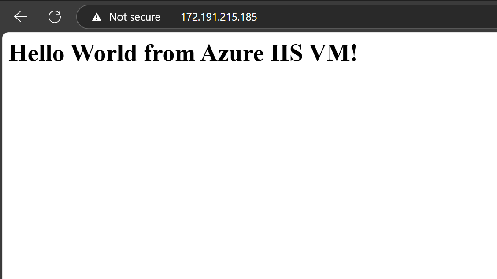
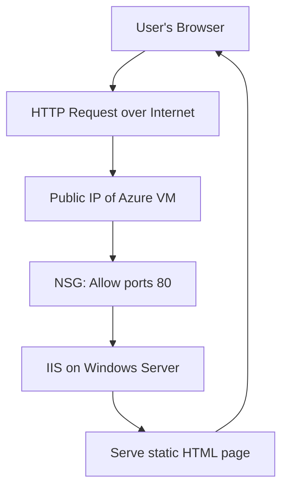

## Project 2: Deploying a Basic Windows Web Server (IIS) on an Azure VM

### Real-World Problem Scenario

A small development team requires a dedicated server to host a simple internal web application, such as a company intranet page or a testing environment. This application specifically necessitates a Windows Server operating system for compatibility or legacy reasons.

---

### Why This Matters & Our Architectural Approach

#### Problem

Acquiring, provisioning, and maintaining physical servers on-premises is a capital-intensive and time-consuming endeavor. Such a setup often lacks inherent scalability and flexibility, making it difficult to adapt to changing demands. While a local virtual machine (VM) on a personal computer might suffice for initial development, it does not accurately simulate a production-ready, externally accessible, and resilient environment.

#### Why This Way

Azure Virtual Machines (VMs) provide an Infrastructure-as-a-Service (IaaS) offering, granting full control over the operating system while leveraging Azure's scalable and reliable global infrastructure. This enables rapid provisioning of server resources and ensures external accessibility, aligning directly with the **Performance Efficiency** and **Operational Excellence** principles of the [Azure Well-Architected Framework](https://learn.microsoft.com/en-us/azure/architecture/framework/).

This project serves as a fundamental introduction to IaaS, demonstrating how to provision and configure a server in the cloud — a crucial skill for organizations looking to "lift and shift" existing on-premises workloads. It also introduces the basic concept of network security through the configuration of **Network Security Groups (NSGs)** to control inbound traffic.

---

### Azure Services Involved

- **Azure Virtual Machines (VM)**
- **Network Security Groups (NSG)**
- **Virtual Network (VNet)**

---

### Step-by-Step Implementation Guide

#### 1. Sign in to Azure Portal

Access the [Azure Portal](https://portal.azure.com) using your credentials.

#### 2. Create a Virtual Machine

- In the search bar, type **"Virtual Machines"**, select the service, then click **Create > Azure Virtual Machine**.

#### 3. Configure VM Details

- **VM Name**: `myVM`
- **Image**: *Windows Server 2022 Datacenter: Azure Edition - x64 Gen 2*
- **Username**: `azureuser`
- **Password**: Strong password (min 12 characters with complexity)
- **Inbound ports**: Select **RDP (3389)** and **HTTP (80)** to enable remote desktop and web access.

#### 4. Review + Create

- Accept default settings and click **Review + Create**.
- After validation, click **Create** to deploy the VM.

#### 5. Connect to VM via RDP

- Once deployed, go to the VM’s Overview in the Azure Portal.
- Click **Connect > RDP**, download the RDP file, and open it.
- Use your credentials to log in (e.g., `localhost\azureuser` and your password).

#### 6. Install Web Server (IIS)

- In the VM, open **PowerShell** and run:

  ```powershell
  Install-WindowsFeature -name Web-Server -IncludeManagementTools
  

### 7. Create and Deploy a Sample HTML Page

On the VM, open Notepad and paste the following HTML:

```html
<html>
  <head><title>Hello World</title></head>
  <body><h1>Hello World from Azure IIS VM!</h1></body>
</html>
```

Save the file as `index.html` in the folder:

```makefile
C:\inetpub\wwwroot
```

This is the default root directory for IIS web content.

---

### 8. Verify Web Server from External Browser

- Back in the Azure Portal, navigate to your VM’s **Overview**.
- Copy the **Public IP address**.
- Paste it into a browser on your local machine (not inside the VM).
- You should see the **“Hello World”** page — confirming that IIS is serving your custom HTML file and external access is working via port 80.



---

### Expected End-User/Customer Benefits

- **Rapid Deployment**: Provision and configure servers in minutes.
- **Scalability**: Easily resize or scale VMs based on demand.
- **Cost-Efficiency**: Pay-as-you-go pricing eliminates large capital investments.
- **Accessibility**: The application is accessible from anywhere with internet access.

---

### Architectural Diagram / Flowchart

**Conceptual Flow:**

1. A user’s browser sends an HTTP request over the internet.  
2. The request reaches the **Public IP** of the Azure VM.  
3. The **NSG** allows inbound traffic on ports **80 (HTTP)** and **3389 (RDP)**.  
4. **IIS** on the Windows Server processes the request.  
5. IIS serves the **static HTML page** back to the user's browser.


