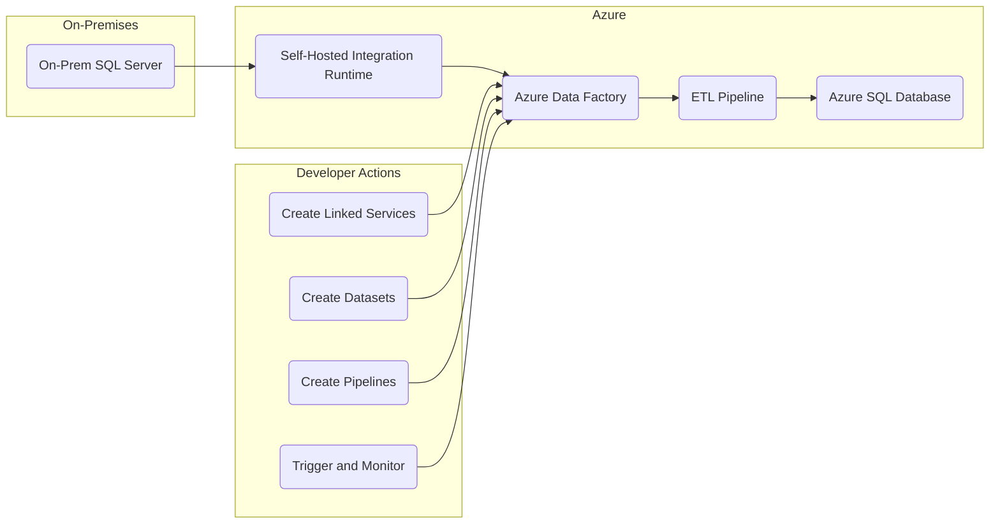

# Project 6: Building a Simple ETL Pipeline with Azure Data Factory

## Real-World Problem Scenario

A company maintains its sales data in an on-premises SQL Server database. To facilitate comprehensive reporting and analytics, this data needs to be regularly extracted, transformed (e.g., cleaned, aggregated, or filtered), and then loaded into an Azure SQL Database, which serves as the cloud-based data warehouse.

## Why This Matters & Our Architectural Approach

**Problem:**  
Manually extracting, transforming, and loading data from disparate sources is a time-consuming, labor-intensive, and error-prone process. Such manual interventions are not scalable as data volumes grow or as the frequency of data updates increases. Without an automated and reliable data pipeline, businesses struggle to obtain timely and accurate insights, hindering data-driven decision-making.

**Why This Way:**  
Azure Data Factory (ADF) is a cloud-based Extract, Transform, Load (ETL) and Extract, Load, Transform (ELT) service specifically designed to orchestrate data movement and transformation workflows across various data sources and destinations.  
ADF provides a rich set of connectors that enable seamless integration with diverse data stores, including both on-premises databases and various cloud services.  
Its ability to schedule pipelines makes it ideal for automating batch data ingestion processes.  
For connecting to on-premises data sources, ADF utilizes a Self-Hosted Integration Runtime, which acts as a secure bridge between the on-premises network and Azure.

This architectural choice significantly enhances **Operational Excellence** by automating routine data tasks and improves **Performance Efficiency** by providing scalable data processing capabilities. ADF's ease of use and built-in connections make it a robust choice for hybrid ETL, solving the common business problem of unifying data from disparate systems into a central analytics platform.

**Azure Services Involved:**  
- Azure Data Factory  
- Azure SQL Database  
- Self-Hosted Integration Runtime (for on-premises connectivity)

---

## Step-by-Step Implementation Guide

### 1. Prepare On-Premises SQL Server
- On your local PC, set up a SQL Server instance. This can be achieved using Docker, a VMware virtual machine, or a direct installation.
- Populate this instance with sample sales data (e.g., create a `Sales` table with columns like `TransactionID`, `ProductID`, `Quantity`, `Price`, `TransactionDate`).

### 2. Create Azure SQL Database
- In the Azure Portal, create a new Azure SQL Database.
- Note down its server name, database name, and admin credentials.
- You will use this as the destination for your transformed data.

### 3. Create Azure Data Factory
- In the Azure Portal, search for **"Data factories"** and create a new Azure Data Factory instance.
- Choose a suitable name, resource group, and region.

### 4. Install Self-Hosted Integration Runtime
- Navigate to your Azure Data Factory instance.
- Under **Manage > Integration runtimes**, create a new Self-Hosted Integration Runtime.
- Download and install the integration runtime software on your local PC where the on-premises SQL Server resides.
- Register it with your ADF instance using the provided key.
- This component acts as a secure gateway for ADF to access your on-premises data.

### 5. Create Linked Services in ADF
- In ADF Studio (accessed via **Launch Studio** from your ADF overview), go to **Manage > Linked services**.
- Create a new linked service for your on-premises SQL Server:
  - Select **SQL Server** as the data store type.
  - Choose your newly installed Self-Hosted Integration Runtime.
  - Provide the connection details for your local SQL Server.
- Create another linked service for your Azure SQL Database:
  - Select **Azure SQL Database** as the data store type.
  - Provide its connection string or server details.

### 6. Create Datasets in ADF
- Go to **Author > Datasets**.
- Create a new dataset for your source (on-premises SQL table):
  - Select the on-premises SQL Server linked service.
  - Specify the table (e.g., `Sales`).
- Create another dataset for your sink (Azure SQL table):
  - Select the Azure SQL Database linked service.
  - Specify the target table (e.g., `Sales_Cleaned`).

### 7. Create a Data Flow/Copy Activity in ADF
- Go to **Author > Pipelines**. Create a new pipeline.
- Drag and drop a **Copy data** activity onto the canvas.
- Configure the **Source** tab to use your on-premises SQL Server dataset.
- Configure the **Sink** tab to use your Azure SQL Database dataset.
- For simple transformations (e.g., column mapping, basic filtering):
  - Use the **Mapping** tab within the Copy Data activity.
  - Or consider a **Data Flow** activity for more complex transformations.

### 8. Trigger and Monitor Pipeline
- Publish all changes in ADF Studio.
- Manually trigger the pipeline by clicking **Add Trigger > Trigger Now**.
- Monitor its execution in the **Monitor** tab of ADF Studio to observe the data transfer and transformation progress.

---

## Expected End-User/Customer Benefits

- **Automated Data Flow:**  
  Eliminates manual data handling, significantly reducing human errors and the time required for data preparation.

- **Data Consistency:**  
  Ensures that the data used for reporting and analysis is always up-to-date and accurate, leading to more reliable business insights.

- **Scalable Data Processing:**  
  Azure Data Factory scales to handle growing data volumes and increasing complexity of transformation logic, adapting to business needs.

- **Improved Business Insights:**  
  Provides reliable and timely data feeds to dashboards and reports, enabling more informed and agile business decisions.
