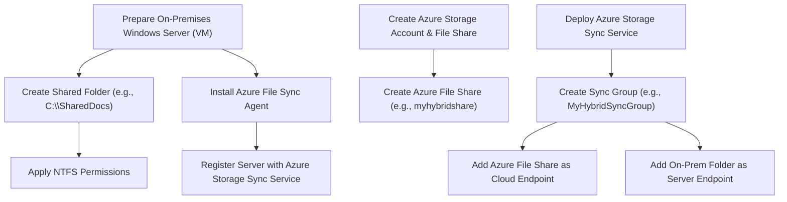

# Project 7: Migrating an On-Premises File Share to Azure Files with Azure File Sync (Hybrid Scenario)

## Real-World Problem Scenario
A small office relies on a traditional shared network drive hosted on an on-premises file server. While local performance is crucial for frequently accessed files, the organization desires to leverage cloud benefits such as cost reduction, enhanced backup capabilities, and improved remote access for less frequently used data, without completely abandoning their on-premises setup.

## Why This Matters & Our Architectural Approach

**Problem:**  
Traditional on-premises file servers incur significant costs for hardware acquisition, maintenance, and power. They often lack inherent disaster recovery capabilities, and providing secure, high-performance remote access can be complex and expensive. A complete "lift and shift" of all file data to purely cloud storage might introduce unacceptable latency for local users who frequently access large files.

**Why This Way:**  
Azure Files offers fully managed cloud file shares (supporting SMB and NFS protocols), providing scalability, durability, and global accessibility. Azure File Sync extends this capability by allowing organizations to cache frequently accessed files locally on a Windows Server, while automatically tiering colder, less frequently used data to the Azure File Share in the cloud. This creates a robust hybrid solution that combines the benefits of cloud storage (cost efficiency, disaster recovery, scalability) with the low-latency performance of on-premises access.

This approach directly aligns with the Cost Optimization, Reliability, and Performance Efficiency pillars of the Well-Architected Framework. The user's powerful local PC is an ideal environment to host the "on-premises" Windows Server, enabling a realistic simulation of this hybrid scenario. This represents a practical "replatform" migration strategy within the Cloud Adoption Framework, balancing cloud advantages with existing operational needs, a common requirement for enterprise cloud adoption.

The solution also ensures file fidelity, preserving permissions and timestamps during migration.

**Azure Services Involved:**  
- Azure Storage Account (File Shares)  
- Azure File Sync

## Step-by-Step Implementation Guide

1. **Prepare On-Premises Windows Server (Your PC):**  
   Install a Windows Server operating system (e.g., Windows Server 2019 or 2022) within a VMware virtual machine or Hyper-V on your local PC. Create a shared folder on this server (e.g., `C:\SharedDocs`) and populate it with some sample files and folders, ensuring you apply some NTFS permissions to simulate a real-world scenario.

2. **Create Azure Storage Account & File Share:**  
   In the Azure Portal, create a new General-purpose v2 storage account. Within this storage account, create an Azure File Share (e.g., `myhybridshare`). This will be your cloud endpoint for file synchronization.

3. **Deploy Storage Sync Service:**  
   In the Azure Portal, search for **Storage Sync Services** and create a new instance. This service orchestrates the synchronization between your on-premises server and the Azure File Share.

4. **Install Azure File Sync Agent & Register Server:**  
   On your Windows Server VM (on your PC), download and install the Azure File Sync agent. After installation, a server registration wizard will appear. Use this wizard to sign in with your Azure credentials and register your on-premises server with the Storage Sync Service you created in the previous step.

5. **Create Sync Group:**  
   In the Azure Portal, navigate to your Storage Sync Service. Create a new **Sync group** (e.g., `MyHybridSyncGroup`). Within this sync group, add your Azure File Share (created in step 2) as the **cloud endpoint**. Then, add your on-premises shared folder (e.g., `C:\SharedDocs`) as a **server endpoint**, selecting your registered server.

6. **Enable Cloud Tiering (Optional):**  
   After the sync group is established, you can enable cloud tiering on the server endpoint. This feature automatically moves infrequently accessed files from the local server to the Azure File Share, replacing them with pointers (reparse points). When a tiered file is accessed, it is seamlessly recalled from Azure. This optimizes local storage space.

7. **Verify Synchronization:**  
   Observe the files synchronizing between your on-premises shared folder and the Azure File Share. Test access to files from both locations, ensuring that changes made in one location are reflected in the other. Verify that NTFS permissions are preserved.

## Expected End-User/Customer Benefits

- **Reduced On-Premises Costs:**  
  Lower expenses associated with hardware procurement, maintenance, and power consumption for file servers.

- **Enhanced Data Protection:**  
  Leverages Azure's robust cloud backup and disaster recovery capabilities for file shares, providing business continuity.

- **Global Accessibility:**  
  Files become accessible from anywhere with an internet connection via Azure Files, facilitating remote work and collaboration.

- **Local Performance:**  
  Frequently accessed files remain cached locally on the on-premises server, ensuring fast access speeds for users within the office.

- **Simplified Management:**  
  Centralized management of file shares through Azure, reducing the complexity of distributed file server environments.
